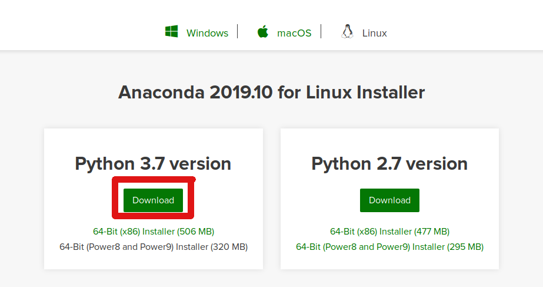
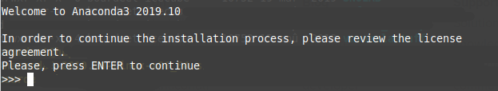
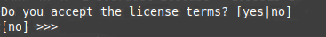
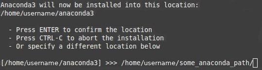
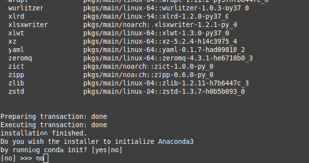

[Back to main page](../README.md)

## Installation instruction - Linux system

These steps have been tested on a Linux Mint 18, a variant of the Ubuntu flavour of linux systems.

### Installing the Anaconda environment

In order to run the exercices from the course, you will need to setup and install __anaconda for python 3__. 

On the [anaconda website](https://www.anaconda.com/distribution/), download the python 3.7 version of anaconda. ake sure you are downloading the version that matches your <b>processor type </b> (you should download the x86 installer)

In the folder where you downloaded the installation script, run the latter using `bash Anaconda3-2019.10-Linux-x86_64.sh`. Type `enter` to start the process

Click here for image 

Scroll through the licence agreement by pressing the return key. At the end, type `yes` to accept the license terms and conditions.

Click here for image 

Anaconda provides you with a default path where it will install the relevant software. It is recommended that you change this directory name, like the example shown here. Once you have entered a new path name, type the return key and the installation will proceed.

Click here for image 

Once the installation is finished, you will be asked if you ant to initialize the environment. __Type `no` to this step__.

Click here for image 

Move to your home folder by typing `cd`. Open a file named `.bashrc`, and add the following line at the bottom of the file:
`alias anaconda3="export PATH=/home/username/some_path_name/bin:$PATH;source /home/username/some_path_name/bin/activate"`

Close your terminal and open a new one. When you type in `anaconda3`, your new anaconda environment should load. You are then ready to work on your notebooks.

### installing the iminuit minimizer tool

Open a new terminal, and load the anaconda environment by typing `anaconda3`. To install iminuit, type in the command: `conda install -c anaconda iminuit`. A prompt such as the one shown below will ask you to install the package, along with its dependencies (ie. additional software that iminuit needs to run properly)

Click here for image 

Type in `y` and wait for the installation to complete. You should now be able to run the course notebooks.

### Clone the course repository

* Open a __terminal window__.

* If you don't have git installed on your laptop, install it by following [these instructions](https://gist.github.com/derhuerst/1b15ff4652a867391f03#file-linux-md)

* Clone the Applied statistics repository using the command 
`git clone https://github.com/AppliedStatisticsNBI/AppStat2020.git ./AppStat2020_local/`. 
 Feel free to choose another name for your folder

* You now have a local copy of the repository

__Make sure you run the command__ `anaconda3` before running a notebook.
