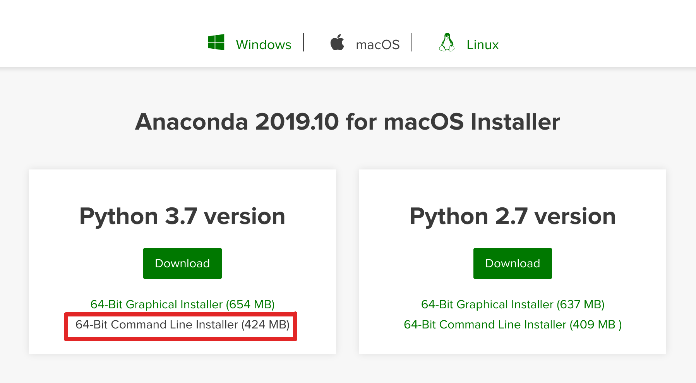

[Back to main page](../README.md)

## Installation instruction - MacOs

These instructions have been tested on a macbook pro from 2015 running the Mojave OS. 

### Download Anaconda3

* Go to the [anaconda website] and download the __Command line installer__ for Mac.

Click to see snapshot

* In the __Launchpad__, find and click on the __Terminal__ icon.

* Once in the terminal, run the __anaconda installer__, by typing

  `bash $HOME/Downloads/Anaconda3-2019.10-MacOSX-x86_64.sh`

* Scroll through the terms of the license and type `yes` to accept. You will be asked to define a path where anaconda can be installed. Feel free to use the pathname you want (we would suggest `/Users/your_username/AppliedStatistics/anaconda3/`)

* Anaconda will now install itself. At the end of the process, you will be asked if you want to initialize anaconda. __Type "No"__

* Move back to your home directory by typing `cd $HOME`. Open a file called `.bash_profile`, and type in at the bottom of the file the following line:

  `alias anaconda3=". /path/where/you/saved/anaconda3/etc/profile.d/conda.sh; conda activate base"`

* Close your terminal and reopen a new one. To run anaconda, type in the command:

  `anaconda3`

### Install iminuit

* Open a new terminal. Load the anaconda environment by typing in `anaconda3`. Then type in the command:

  `conda install iminuit`

* Type `y` once the installer finds the dependencies that will be installed. You should now be able to run the applied statistics course exercices.

### Clone the Applied Statistics Repository

*  In a folder of your choice, run the command for cloning the repository:

  `git clone https://github.com/AppliedStatisticsNBI/AppStat2020.git .`

To run a notebook, make sure you activate your anaconda environment by typing `anaconda3`. You are now set to work on the notebooks!
