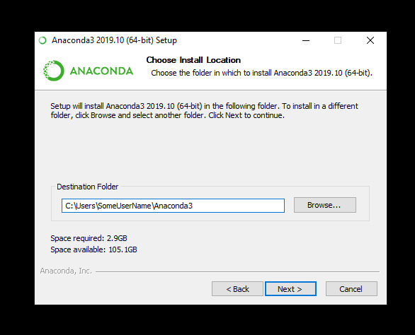

[Back to main page](../README.md)

## Installation instruction - Windows

### __NOTE: WINDOWS INSTRUCTIONS ARE UNLIKELY TO WORK ON OLDER VERSIONS OF WINDOWS. IF YOU DON'T HAVE WINDOWS 10, WE RECOMMEND YOU DO YOUR WORK ON ERDA INSTEAD OF YOUR OLD LAPTOP__

### Installing Anaconda on Windows 10
---
These steps have been tested on an up-to-date version of Windows 10 (admittedly, only tested/updated Nov. 4 2019).

On the [anaconda website](https://www.anaconda.com/distribution/), download the python 3.7 version of the anaconda installer for windows. __Make sure to select the right file for your system (32-bit or 64-bit)__

Click here for a picture

Launch the installer program, and click __next__.

Click here for a picture

Click on __I agree__ at the bottom of the licence.

Click here for a picture

Select the __Just me__ option.

Click here for a picture

Select the folder where you want to install anaconda and click on __Next__.

Click here for a picture

Make sure that both options are unchecked and click __install__.

Click here for a picture

Once the installation finishes, click on __Next__.

Click here for a picture

Click on __Finish__ to complete the installation

Click here for a picture

### Installing iminuit

Iminuit should already be installed on the windows version of anaconda.

### Cloning the git repository
---
Download [git for windows](https://git-scm.com/download/win) and download the installer for your system (32-bit or 64-bit)

Click here for a picture

Run the installer. Click on Next

Click here for a picture

Select a location where to install git (it is recommended to use the default path)

Click here for a picture

In the select Components window, leave the options checked to default. Make sure that __Git Bash__ is checked

Click here for a picture

Keep clicking on __Next__ through the various options, leaving them at their default values.

Click here for a picture

  
  
  
  
  
  
  

Keep clicking on __Install__. Leave the option on that window unchecked. 

Click here for a picture

  

Keep clicking on __Finish__ after the process is completed.

Click here for a picture

  

Once this is done, open the __Windows Explorer__ window, create a new folder where you want to save the repository, and right click inside that folder. There should now be an option in the menu called __Git Bash Here__

Click here for a picture

  

The previous steps opens a terminal window at the location you created. In that terminal window, type in the command:
`git clone https://https://github.com/troelspetersen/AppliedML2021 .` 

Click here for a picture

  

